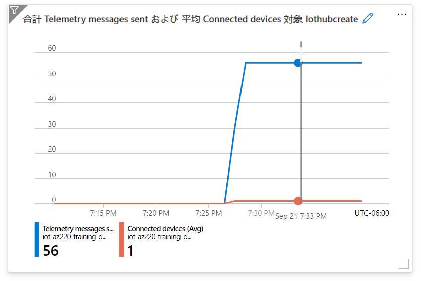
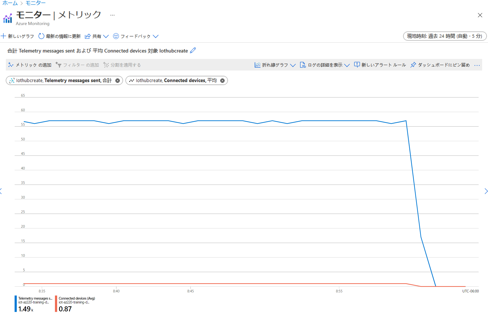

---
lab:
  title: 'ラボ 17: Azure IoT Hub を管理する方法'
  module: 'モジュール 9: ソリューションのテスト、診断、およびログ記録'
---

# Azure IoT Hub を管理する方法

## ラボ シナリオ

Contoso の資産監視およびトラッキング ソリューションは、優れた機能を提供しています。システムは包装および出荷プロセス全体で連続的な監視を提供しています。DPS 内にグループ登録を実装してデバイスを大規模にプロビジョニングし、コンテナーが宛先に到着すると、IoT デバイスは DPS を通じて「廃止」 され、将来の出荷に再利用できます。

IT 部署は、デバイスの使用率やその他のソリューションの特性を管理するために、IoT ソリューション内に Azure の監視およびログ サービスを実装するようチームに依頼しました。

追加のワークロードにコミットする前に、IT 担当者と確認できる簡単なメトリックを実装することに同意します。

このラボでは、接続デバイスとテレメトリ メッセージの送信数を追跡し、接続イベントをログに送信する監視を実装します。さらに、接続デバイスの数が 1 台未満に減るとトリガーされるアラートを作成します。システムをテストするには、1 台のデバイスとストリーム テレメトリを接続し、その後、デバイスを切断して、アラートを生成します。

次のリソースが作成されます。


## このラボでは

このラボでは、次のタスクを正常に達成します。

- ラボの前提条件が満たされていることを確認する (必要な Azure リソースがあること)。
- IoT デバイスをシミュレートするアプリをダウンロードして実行し、ハブにメッセージを送信する。
- アプリを実行して、テレメトリを生成する。
- 診断ログを有効にする。
- メトリックを有効にする。
- それらのメトリックのアラートを設定する。
- アプリを終了して、アラートを発生させる。
- メトリックを観察し、診断ログを確認する。

## ラボの手順

### 演習 1: ラボの前提条件を確認する

このラボでは、次の Azure リソースが使用可能であることを前提としています。

| リソースの種類        | リソース名                   |
| :-------------------- | :--------------------------- |
| リソース グループ     | rg-az220                     |
| IoT Hub               | iot-az220-training-{your-id} |
| ストレージ アカウント | staz220training{your-id}     |
| デバイス ID           | sensor-thl-2002(対称キー)              |

必要に応じて、リソースの作成とデバイスの登録を行なってください。以下の手順を実行することでも作成と登録が可能です。

1. 「**Azure へのデプロイ**」を選択:します。

   [Azure へのデプロイ](https://portal.azure.com/#create/Microsoft.Template/uri/https%3A%2F%2Fraw.githubusercontent.com%2FMicrosoftLearning%2FAZ-220-Microsoft-Azure-IoT-Developer%2Fbicep%2FAllfiles%2FARM%2Flab17.json)

1. メッセージが表示されたら、**Azure portal** にログインします。

   「**カスタム デプロイ**」ページが表示されます。

1. 「**サブスクリプション**」ドロップダウンの「**プロジェクトの詳細**」で、このコースで使用しようとしている Azure サブスクリプションが選択されていることを確認します。

1. 「**リソース グループ**」ドロップダウンで、「**rg-az220**」を選択します。

   > **注**: 「**rg-az220**」が表示されていない場合は、次の手順を行います。
   >
   > 1. 「**リソース グループ**」 ドロップダウンで、「**新規作成**」 をクリックします。
   > 1. 「**名前**」に「**rg-az220**」と入力します。
   > 1. 「**OK**」をクリックします。

1. 「**リージョン**」ドロップダウンの「**インスタンスの詳細**」で、最寄りのリージョンを選択します。

   > **注**: 「**rg-az220**」グループが既に存在している場合、"**リージョン**" フィールドは、読み取り専用のリソース グループによって使用されるリージョンに設定されます。

1. 「**自分の ID**」 フィールドに、演習 1 で作成した固有の ID を入力します。

1. 「**コース ID**」 フィールドに、「**az220**」と入力します。

1. テンプレートを検証するには、「**確認と作成**」をクリックします。

1. 検証に合格したら、「**作成**」をクリックします。

   デプロイが開始します。

1. デプロイが完了したら、左側のナビゲーション エリアで、「**出力**」をクリックして、テンプレートからの出力値を確認します。

   後で使用する場合のために、出力をメモしておきます。

   - connectionString
   - deviceConnectionString
   - devicePrimaryKey
   - storageAccountName

これで、リソースが作成されました。

### 演習 2: デバイスのシミュレーション

この演習では、上記で生成されたデバイス接続文字列を使用して、デバイス シミュレーターを構成し、IoT Hub に接続します。実行されたら、アプリケーションによって、アクティブな接続が作成され (接続デバイスとしてカウントされます)、テレメトリが生成されます。

#### タスク 1: デバイス シミュレーターを構成して実行する

デバイス シミュレーターを構成して、実行します。

1. Visual Studio Code を開きます。

1. 「**ファイル**」 メニューで、「**フォルダーを開く**」 をクリックします。

1. 「**フォルダを開く**」 ダイアログで、ラボ 17 Starter フォルダに移動し、「**Starter**」 をクリックし、「**フォルダの選択**」 をクリックします。

   > **注**: Visual Studio Code が、アセットの読み込みや復元の実行を推奨している場合は、次の推奨事項に従います。

1. 「**エクスプローラ**」 ペインで、Program.cs ファイルを開くには、「**Program.cs**」 をクリックします。

1. Visual Studio Code で **Program.cs** ファイルを開いていることを確認します。

1. **Program** クラスの先頭近くにある `deviceConnectionString` 変数宣言を見つけます。

   ```csharp
   private readonly static string deviceConnectionString = "<your device connection string>";
   ```

1. `<your device connection string>` をsensor-thl-2002のデバイス接続文字列に置き換えます。

   > **注**: これは、このコードに対して行う必要がある唯一の変更です。

1. 「**ファイル**」 メニューの 「**上書き保存**」 をクリックします。

1. 必要に応じて、コードを確認する時間を取ります。

このアプリは、前のラボで使用したアプリにとても似ています。

#### タスク 2: シミュレーターの実行

1. Visual Studio Code の、「**ターミナル**」 メニューで、「**新しいターミナル**」 をクリックします。

1. ターミナル コマンド プロンプトで、アプリを実行するには、次のコマンドを入力します。

   ```bash
   dotnet run
   ```

   このコマンドは、 現在のフォルダー内の **Program.cs** ファイルを実行します。

1. 次のようなコンソール出力が表示されます。

   ```text
   ❯ dotnet run
   IoT Hub C# Simulated Cave Device. Ctrl-C to exit.
   9/21/2021 5:29:03 PM > Sending message: {"temperature":21.709826510264456,"humidity":69.90892255208871,"pressure":1013.2884857487113,"latitude":39.866200822820204,"longitude":-98.44082869457793}
   9/21/2021 5:29:04 PM > Sending message: {"temperature":27.536429445043407,"humidity":79.17065790815775,"pressure":1020.8587537331547,"latitude":40.150104471097904,"longitude":-98.40412401158297}
   9/21/2021 5:29:05 PM > Sending message: {"temperature":30.732068391857702,"humidity":65.15873178148583,"pressure":1017.6406480895312,"latitude":40.09271254628759,"longitude":-98.26298329932496}
   ```

デバイスが接続され、テレメトリが送信中の状態となるよう、アプリを実行したままにしておきます。

### 演習 3: IoT Hub を使用したメトリックと診断ログの設定と使用

Azure リソース ログは、内部操作を記述する Azure リソースによって出力されるプラットフォーム ログです。すべてのリソース ログは共通の上位スキーマを共有し、各サービスで独自のイベントの一意のプロパティを出力する柔軟性を持ちます。

運用環境で実行されている IoT Hub ソリューションがある場合は、さまざまなメトリックを設定し、診断ログを有効にします。問題が発生した場合は、問題を診断し、より迅速に修正するのに役立つデータを確認します。

この演習では、診断ログを有効にし、それらを使用してエラーをチェックします。また、監視するメトリックを設定し、メトリックが一定の境界基準に達したときに発生するアラートも設定します。

#### タスク 1: 診断を有効化する

1. 必要な場合は、お使いの Azure アカウントの資格情報を使用して Azure portal にログインします。

   複数の Azure アカウントをお持ちの場合は、このコースで使用するサブスクリプションに関連付けられているアカウントを使用してログインしていることを確認してください。

1. Azure ダッシュボードで、「**iot-az220-training-{your-id}**」 をクリックします。

   ダッシュボードには、rg-az220 リソース グループ タイルの IoT Hub へのリンクが必要です。

1. 左側のメニューの 「**監視**」 の下にある、 「**診断の設定**」 をクリックします。

   > **注**: 現在のドキュメントでは、診断が既定で無効になっている可能性があることが示唆されています。その場合、IoT Hub の診断データを収集するために「診断を有効にする」必要があります。「**診断を有効にする**」 をクリックすると、「**診断設定**」 ペインが開きます。

1. 「**診断設定**」 ペインで、「**名前**」 の下にある 「**+ 診断設定の追加**」 をクリックします。

1. 「**診断設定名**」 テキスト ボックスに「**diags-hub**」と入力します。

1. 「**宛先の詳細**」 に表示されるオプションを確認してください。

   メトリックのルーティングに使用できるオプションが 4 つあることがわかります - それぞれの詳細については、以下のリンクを参照してください。

   - [Azure リソース ログをストレージ アカウントにアーカイブする](https://docs.microsoft.com/ja-jp/azure/azure-monitor/platform/resource-logs-collect-storage)
   - [イベント ハブへの Azure 監視データのストリーム配信](https://docs.microsoft.com/ja-jp/azure/azure-monitor/platform/stream-monitoring-data-event-hubs)
   - [Azure Monitor の Log Analytics ワークスペースで Azure リソース ログを収集する](https://docs.microsoft.com/ja-jp/azure/azure-monitor/platform/resource-logs-collect-workspace)
   - [パートナー ソリューションへの送信](https://docs.microsoft.com/ja-jp/azure/azure-monitor/partners)

   このラボでは、ストレージ アカウント オプションを使用します。

1. 「**保存先の詳細**」 で 、「**ストレージ アカウントにアーカイブする**」 をクリックします。

   この出力先オプションを選択すると、ログ カテゴリの **リテンション期間 (日)** を指定するオプションを含む追加のフィールドが使用可能になります。

   > **注**: ストレージ アカウントとコストに関する注意事項を確認してください。

1. 「**サブスクリプション**」 フィールドで、IoT Hub の作成に使用したサブスクリプションを選択します。

1. 「**ストレージ アカウント**」 フィールドで、**staz220training{your-id}** ストレージ アカウントを選択します。

   このアカウントは、lab17-setup.azcli スクリプトによって作成されました。ドロップダウンに表示されない場合は、手動でアカウントを作成します。

1. 「**診断の設定**」 ブレードの 「**カテゴリの詳細**」 で 、「**Connections**」 をクリックし、「**DeviceTelemetry**」 をクリックします。

1. 選択したログ カテゴリごとに、「**リテンション期間 (日)**」 フィールドに **「7」** と入力します 。

1. ブレードの上部にある 「**保存**」 をクリックし、ブレードを閉じます。

   IoT Hub の 「**診断の設定**」 ペインで、作成した **diags-hub** 設定を表示するために**診断設定**の一覧が更新されたことが確認できます。

   その後、ログを見ると、テレメトリ、およびデバイスの接続/切断ログ記録を確認することができます。

#### タスク 2: メトリックの設定

このタスクでは、メッセージが IoT Hub に送信されるタイミングを監視するさまざまなメトリックを設定します。

> **注意**: 結果をすばやく確認できるようにするため、この演習ではタイムラインを短縮します。運用環境では、間隔を長くする方が適切である場合があります。

1. IoT Hub ブレードが開いていることを確認します。

1. 左側のメニューの 「**監視**」 で、「**メトリック**」 をクリックします。

   「**メトリック**」 ペインに、新しい空のグラフが表示されます。

1. 画面の右上にあるグラフの時間の範囲と粒度を変更するには、「**過去 24 時間 (自動)**」 をクリックします。

1. 表示されるコンテキスト メニューの「**時間の範囲**」で、「**過去 30 分間**」をクリックします。

1. 時刻の設定を保存するには、「**適用**」 をクリックします。

1. グラフのメトリックを指定するための設定が使用されていることを確認してください。

   **グラフのタイトル**とツールバーの下に、メトリックを指定する領域が表示されます。

   - 「**スコープ**」 が既に **iot-az220-training-{your-id}** に設定されていることに注意してください。
   - 「**メトリック名前空間**」 は既に **IoT Hub 標準メトリック**に設定されています。

   > **注**: 既定では、使用できるメトリック名前空間は 1 つだけです。名前空間は類似のメトリックを分類またはグループ化する方法です。名前空間を使用すると、収集する情報またはパフォーマンス指標に基づいてメトリックのグループを分離できます。たとえば、アプリをプロファイリングするメモリ使用量のメトリックを追跡する **az220memorymetrics** という名前空間があるとします。**az220apptransaction** と呼ばれる別の名前空間は、アプリケーション内のユーザー トランザクションに関するすべてのメトリックを追跡する場合があります。カスタム メトリックスと名前空間の詳細については、[こちら](https://docs.microsoft.com/ja-jp/azure/azure-monitor/platform/metrics-custom-overview?toc=%2Fazure%2Fazure-monitor%2Ftoc.json#namespace)を参照してください。

   次の手順では、IoT Hub に送信されたテレメトリ メッセージの数を監視するために使用するメトリックを追加します。

1. 「**メトリック**」 ドロップダウンで、「**Telemetry messages sent**」 をクリックします。

   選択できるメトリックの数はたくさんあります。

1. 「**集計**」 で 「**合計**」 が選択されていることを確認します。

   4 つの集計操作 - _平均_、_最小_、_最大_、_合計_ が使用可能であることに注意してください。

1. グラフを確認してください。

   選択したメトリックを反映するように、グラフのタイトルが更新されていることに注目してください。

   最初のメトリックの仕様を完了しました。次に、接続されているデバイスの数を監視するメトリックを追加します。

1. グラフのタイトルの下にあるツール バーで、「**メトリックの追加**」 をクリックします。

   新しいメトリックが表示されます。「**スコープ**」 と 「**メトリック名前空間**」 の値は事前に設定されています。

1. 「**メトリック**」ドロップダウンで、「**Connected devices**」をクリックします。

1. 「**集計**」 で 「**平均**」 が選択されていることを確認します。

   画面に、送信された製品利用統計情報のメッセージの最小メトリックと、接続されているデバイスの平均値の新しいメトリックが表示されます。グラフのタイトルが両方のメトリックを反映するように更新されていることに注意してください。

   > **注**: グラフ タイトルを編集するには、タイトルの右にある **鉛筆** をクリックします。

1. 「**グラフのタイトル**」 の下のツールバーの右側で、「**ダッシュボードにピン留め**」 をクリックし、「**現在のダッシュボードにピン留め**」 をクリックします。

   > **注**: 作成したグラフを保持するには、 ダッシュボードにピン留めする**必要**があります。

1. 上記で選択したダッシュボードに移動して、グラフが表示されていることを確認します。

   > **注意**: グラフのサイズと位置をカスタマイズできます。

   デバイス シミュレーターが実行中の場合は、テレメトリ メッセージが送信されており、デバイスが接続されていることを確認できるはずです。

   

ログ記録を有効にし、メトリックを監視するグラフを設定したので、警告を設定することをお勧めします。

### 演習 4: アラートを設定する

監視データに重要な条件が見つかった場合、アラートが事前に通知されます。システムのユーザーが問題に気付く前に、問題を特定して対処できます。

資産トラッキング シナリオでは、センサーを使用して、顧客に出荷されるコンテナーを追跡します。出荷コンテナーにセンサーを追加するたびに、DPS を介して自動プロビジョニングされます。運用環境では、移行中のセンサーの数が所定の容量を超えた場合に、アラートを送信する必要があります。

ただし、今後行う概念実証デモに向けて、簡素化を図るには、コンテナー数が 1 台未満に減るとトリガーされるアラートを作成する必要があります。アラートをトリガーするには、IoT Hub からのデバイス接続イベントの数を使用します。

1. 必要な場合は、お使いの Azure アカウントの資格情報を使用して Azure portal にログインします。

   複数の Azure アカウントをお持ちの場合は、このコースで使用するサブスクリプションに関連付けられているアカウントを使用してログインしていることを確認してください。

1. Azure ダッシュボードで、「**iot-az220-training-{your-id}**」 をクリックします。

   ダッシュボードには、rg-az220 リソース グループ タイルの IoT Hub へのリンクが必要です。

1. 左側のメニューの 「**監視**」 で、「**警告**」 をクリックします。

1. 「アラートルールの作成」をクリックします。

   「**シグナルの選択**」 ペインが表示されます。使用可能なシグナルのページ分割されたテーブルが表示されていることに注意してください。テーブルの上のフィールドは、必要なシグナル タイプを見つけるためのテーブルをフィルター処理します。

1. **シグナルの種類** については、**すべて** が選択されていることを確認してください。

   「シグナルタイプ」 ドロップダウンを開くと、次の 3 つのオプションが表示されます。_全て_、_メトリック_、_アクティビティ ログ_ です。

   > **注**: 監視に使用できるシグナル タイプは、選択したターゲットによって異なります。シグナル タイプは、メトリック、ログ検索クエリ、またはアクティビティ ログです。

1. 「**サービスの監視**」 で、「**すべて**」 が選択されていることを確認します。

   「監視サービス」 ドロップダウンを開くと、次の 3 つのオプションが表示されます。_すべて_、 *プラットフォーム*および _アクティビティ ログ - 管理_。

   > **注**: プラットフォーム サービスはサービス使用率に関するメトリックを提供し、アクティビティ ログは管理アクティビティを追跡します。

1. 「**シグナル名で検索**」 テキスト ボックスに、「 **Connected devices**」と入力します

1. シグナルのリストは、入力内容に基づいて直ちにフィルタリングされます。

1. 「**シグナル名**」 で、「**Connected devices**」 をクリックします。

   ペインが更新され、**メトリック**で作成したものと同様のグラフが表示されます。チャートには、選択したシグナルに関連付けられた値が表示されます (この場合は*接続デバイス (プレビュー)*)。

   グラフの下には、 **アラートロジック** を定義する領域があります。

1. **アラートロジック** のオプションを確認してください。

   **しきい値** には、_静的_ と _動的_ の 2 つの選択が可能であることに注意してください。また、**静的** が選択され、このシグナル タイプでは **動的** が使用できないことにも注意してください。

   > **注**: 名前が示すように、 _静的しきい値_ はしきい値の定数式を指定し、 _動的しきい値_ 検出は詳細な機械学習 (ML) を活用してメトリックの履歴動作を学習し、可能性のあるサービスの問題を示すパターンと異常を特定します。_動的しきい値_ の詳細については、 [こちら](https://docs.microsoft.com/ja-jp/azure/azure-monitor/platform/alerts-dynamic-thresholds) を参照してください。

1. 「**演算子**」ドロップダウンで、「**次の値より小さい**」をクリックします。

   このフィールドと他のフィールドの他のオプションをメモしておきます。

1. **集計タイプ**については、**平均**が選択されていることを確認してください。

1. **しきい値**テキスト ボックスに「**1**」と入力します

   > **注**: **条件プレビュー**には、入力した 「演算子」、「集計タイプ」、および 「しきい値」 の設定に基づいて、表示が更新される条件が表示されます。**条件プレビュー**の下にあるのは、領域 「**に基づく評価**」 です。これらの値は、上記で選択した**集計タイプ**を使用して集計される履歴期間と、条件が評価される頻度を決定します。

1. 「**単位**」 で、「**カウント**」 を選択します。

1. 「**集計の細分度 (期間)**」 で「**1 分**」が選択されていることを確認します。

1. 「**評価の頻度**」 で、「**1 分ごと**」 が選択されていることを確認します。

   > **注**: 「**評価の頻度**」が「**集計の細分度 (期間)**」より短い場合は、スライディング ウィンドウ評価となります。たとえば、「**集計の細分度 (期間)**」が 5 分で、「**評価の頻度**」が 1 分の場合、1 分ごとに、前の 5 分間が集計され (この場合は平均)、その後、条件に対して評価されます。1 分の時間が経過すると、前の 5 分間のデータが再び集計されます 。- これには、1 分の新しいデータと、すでに評価された 4 分のデータが含まれます。したがって、一度に 1 分進むスライディング ウィンドウがありますが、以前のウィンドウの一部としても評価された 4 分のデータを常に含みます。

1. 「**アラートルールの作成**」 ペインの下部で、アラート条件を構成するには、「 **次へ**」 をクリックします。

1. **アクション グループ**を確認してください。

   アクション グループが選択されていません。**アクション グループを選択する**オプションがあります。

   > **注**: アクション グループは、Azure サブスクリプションの所有者によって定義された通知設定を集めたものです。アクション グループ名は、関連付けられているリソースグループ内で一意である必要があります。Azure Monitor および Service Health アラートは、アクション グループを使用して、アラートがトリガーされたことをユーザーに通知します。さまざまなアラートには、ユーザーの要件に応じて、同じアクション グループまたは異なるアクション グループを使用する場合があります。1 つのサブスクリプションで最大 2,000 のアクション グループを構成できます。アクション グループの作成と管理の詳細については、[こちら](https://docs.microsoft.com/ja-jp/azure/azure-monitor/platform/action-groups)を参照してください。

1. 「**アクション**」 で、「**アクション グループの追加**」 を選択します。

   「**このアラート ルールにアタッチするアクション グループを選択する**」 ペインが表示されます。選択したサブスクリプション内で使用可能な既存のアクション グループがある場合、それらはここに一覧表示されます。サブスクリプションを変更してリストをフィルター処理できることに注意してください。このラボでは、新しいアクション グループを作成します。

1. 「**このアラート ルールにアタッチするアクション グループを選択する**」 ペインで、「**アクション グループの作成**」 をクリックします。

   「**アクション グループの作成**」 ペインが表示されます。

1. 「**基本**」 タブの 「**サブスクリプション**」 で、このラボで使用するサブスクリプションが選択されていることを確認します。

1. 「**リソース グループ**」 ドロップダウンで、「**rg-az220**」 をクリックします。

   > **注**: アクション グループは通常、サブスクリプション全体で共有され、Azure サブスクリプション所有者が一元管理する可能性があります。そのため、プロジェクト固有のリソース グループ ("rg-az220") ではなく、共通リソース グループに含まれる可能性が高くなります。ラボ後のリソースのクリーンアップを容易にするために、"rg-az220" を使用しています。

   次の領域である**インスタンスの詳細**は、グループのフルネームと表示名を指定するために使用されます。

1. 「**アクション グループ名**」 に、「**AZ-220 Email Action Group**」と入力します。

   > **注**: アクション グループ名は、関連付けられているリソース グループ内で一意である必要があります。

1. 「**表示名**」 の下に、「**AZ220EmailAG**」を入力します

   > **注**: このグループを使用して通知を送信する場合は、完全なアクション グループ名の代わりに表示名前が使用され、最大 12 文字に制限されます。

1. 「**次へ:**」をクリックします。「**通知**」 をクリックして、アクション グループの通知フィールドを表示します。

1. 「**通知の種類**」 ドロップダウンを開き、使用可能なオプションを確認します。

1. 「**通知の種類**」 ドロップダウンで、「**メール/SMS/メッセージ/プッシュ/音声**」 をクリックします。

   > **注**: 通知の種類を選択すると、新しい空白の行が追加され、複数の通知を追加できるようになります。値のある各行の右側には、「**詳細の編集**」 アイコンと 「**削除**」 アイコンがあります。

   > **注意**: 「**メール/SMS メッセージ/プッシュ/音声**」ブレードが自動的に開きます。

1. 「**名前**」 に、「**AZ220Notifications**」と入力します。

1. 「**メール/SMS メッセージ/プッシュ/音声**」ブレードで、「**メール**」を選択して、普段使用しているメール アドレスを入力します。

1. 「**SMS**」 をクリックし、 SMS アラートの受信に使用する電話の**国番号**と**電話番号**を入力します。

1. 「**Azure アプリのプッシュ通知**」 と 「**音声**」 をスキップします。

1. 「**共通のアラート スキーマを有効にする**」 で、「**はい**」 をクリックします。

   > **注**: 共通アラート スキーマを使用することには、多くの利点があります。今日の Azure でのアラート通知の使用エクスペリエンスを標準化します。これまで、今日の Azure の 3 つのアラートの種類 (メトリック、ログ、およびアクティビティ ログ) には、独自のメール テンプレート、Webhook スキーマなどがあります。共通アラート スキーマを使用すると、一貫性のあるスキーマを使用してアラート通知を受信できるようになりました。共通の ALert6 スキーマの詳細については、[こちら](https://docs.microsoft.com/ja-jp/azure/azure-monitor/platform/alerts-common-schema)を参照してください。

   > **重要:** この利点を考えると、共通アラート スキーマがデフォルトで有効になっていない理由を疑問に思うかもしれませんが、「**はい**」 を選択すると、**共通アラートスキーマを有効にすると既存の統合が損なわれる可能性がある**という警告が表示されます。あなた自身の環境でこれを念頭に置いてください。

1. 「**メール/SMS/メッセージ/プッシュ/音声**」 ブレードの下部でアクション構成を保存するには、「**OK**」 をクリックします。

   通知行に、メールと SMS メッセージが選択されたことが表示されます。さらに変更が必要な場合は、「**詳細の編集**」 アイコンをクリックできます。

1. 「**次へ:**」をクリックします。「**アクション**」 をクリックして、アクション グループのアクション フィールドを表示します。

1. 「**アクション タイプ**」 ドロップダウンを開き、使用可能なオプションを確認します。

   この時点で、_WebHooks_ または *Azure 関数*を使用してビジネス統合を起動する必要がある場合は、複数のアクションを追加できますが、このラボでは簡単な通知で十分です。

1. 「**アクション グループの追加**」 ブレードの下部で、このアクション グループを検証するには、「**確認および作成**」 をクリックします。

1. 検証が完了したら、「**作成**」 をクリックします。

   次に、SMS 通知とメールの両方を受け取り、**AZ220EmailAG** アクション グループに追加されたことを通知します。SMS メッセージでは、メッセージに返信して今後の通知の受信を停止することができます。 それらのオプションの詳細については、[こちら](https://docs.microsoft.com/ja-jp/azure/azure-monitor/platform/alerts-sms-behavior)を参照して下さい。メールには、クリックしてアクション グループの詳細を表示できるリンクがあり、メールの下部 (小さいフォント) に向かって購読停止のオプションが表示されます。

   次に、**アラート ルールの詳細**を構成します。

1. 「**次へ**」 をクリックします。

1. "**アラート ルール名**" フィールドで、「**接続デバイスが 1 台未満**」と入力します

   名前は、警告を識別するのに十分な説明を付ける必要があります。

1. 「**説明**」 フィールドで、「**このアラートは、iot-az220-training-{your-id} ハブに接続されているデバイス数が 1 台未満の場合に発生する**」と入力します。

   説明フィールドはオプションですが、推奨されます。

1. 「**アラートをリソース グループに保存**」 フィールドで、予想されるリソース グループが選択されていることを確認します (例: **rg-az220**)。

1. 「**重要度**」 フィールドで、「**3 - 情報**」 が選択されていることを確認します。

   このシナリオでは、この警告は _情報であり_ 、重大な障害を示すものではないため、「**Sev 3**」 が正しい選択です。

   > **注**: 重要度レベルのオプションの範囲は、**0 - 重要**から **4 - 詳細**です。

   > **注**: メトリック アラート ルールがアクティブになるには、最大 10 分間かかる場合があります。

1. ブレードの下部にある、「**確認および作成**」 をクリックします。

   IoT Hub の 「**警告**」 ウィンドウが表示されます。真ん中のメッセージは、警告がないことを示しており、そのステータス メッセージの下に 「**警告ルールの管理(1)**」」 ボタンが追加されていることがわかります。

   > **注**: ペインが自動的に更新されていない場合は、「**更新**」 をクリックします。

### 演習 4: メトリック、アラート、アーカイブの確認

この演習では、このラボで先ほど構成したレポート リソースとログ リソースの一部を調べ、経過した短時間で記録されたイベント データを確認します。

#### タスク 1: ポータルでのメトリックの確認

接続デバイス数が 1 台未満の場合にアラートを生成するには、デバイス シミュレーター アプリを閉じる必要があります。

1. Visual Studio Code に戻り、実行中のアプリを終了します。

   30 秒ほど待ってから、次の手順に進みます。

1. Azure portal で、グラフ タイトルをクリックして、ダッシュボードにピン留めしたメトリック グラフを開きます。

   グラフが開き、ページに表示されます。

1. 時刻の値を 「**過去 30 分**」 に変更します。

   *送信済みテレメトリ メッセージ*と *接続デバイス*の数が、グラフの下部に最新の値とともに表示されることに注意してください。特定の時点の値を表示するには、マウスをグラフの上に移動します。テレメトリと接続デバイスの線がゼロにまで下がっていることに気づくはずです。

   

#### タスク 2: アラートを見る

Azure portal を使用してアラートを確認するには、次の手順を実行します。

1. Azure portal で、ダッシュボードにもう一度アクセスしてください。

1. Azure portal ツール バーの検索ボックスに、「**モニター**」と入力します。

1. 検索結果ペインの 「**サービス**」 で 「**監視**」 をクリック します。

   「**モニタ - 概要**」 ページが表示されます。これは、現在のサブスクリプションのすべての監視アクティビティの概要です。

1. 左側のメニューで、リストの上部にある 「**アラート**」 をクリックします。

   このアラートビューには、すべてのサブスクリプションのすべてのアラートが表示されます。これを IoT Hub に絞り込みましょう。

1. ブレードの上部近くの 「**サブスクリプション**」 で、このクラスに使用しているサブスクリプションを選択します。

1. 「**リソース グループ**」 ドロップダウンで、「**rg-az220**」 をクリックします。

1. 「**リソース**」 ドロップダウンで、**iot-az220-training-{your-id}** をクリックします

1. 「**時間の範囲**」 ドロップダウンで、「**過去 1 時間**」 をクリックします。

   過去 1 時間のアラートの概要が表示されるはずです。「**合計アラート ルール**」に、「**1**」という、前に作成したアラートが表示されます。この下に、重大度カテゴリの一覧と、カテゴリごとのアラートの数が表示されます。関心の対象となるアラートは **3 - 情報** です。少なくとも 1 つが表示されます (デバイス シミュレーターを停止して再起動した場合は、そのアラートが 1 つ以上生成されている可能性があります)。

   > **注意**: アラートが表示されない場合は数分待ちます。アラートの発生に遅れが生じることがあります。

1. 結果の一覧の、「**3 - 情報**」 をクリックします。

   「**すべてのアラート**」 ページが開きます。ページの上部に、いくつかのフィルター フィールドが表示されます - 選択した IoT Hub の **3 - 情報** アラートのみが表示されるように、上記の画面の値が入力されています。アクティブなアラートと共に、警告があるかどうかが表示されます。

1. 「**名前**」で、3 - 情報アラートを選択し、「**接続デバイスが 1 台未満**」をクリックします。

   アラートの詳細の**概要**が表示されたペインが開きます。これには、アラートが発生した理由を示すチャートが含まれます (ダッシュラインは、しきい値と監視対象メトリックの現在の値を示しています)。以下は、**設定基準**の詳細およびその他の詳細です。

1. ペインの上部にあるタイトルの下の、「**履歴**」 をクリックします。

   このビューでは、いつアラートが発生したか、呼び出されたアクション グループ、およびいつアラートが解決されたなどのその他の変更を確認できます。

1. ペインの上部にあるタイトルの下の 「**診断**」 をクリックします。

   アラートに関連する問題がある場合は、追加の詳細がここに表示されます。

1. この時点、メールとテキストまたはそれら両方を確認し、アラート メッセージを受け取ったことを確認します。

1. アラートを自動的に解決するには、Visual Studio Code に戻り、アプリを再起動します。

   > **注意**: アラートの解決には数分かかるため、続けて残りのタスクを行います。

#### タスク 3: 診断ログを参照する

このラボの前半では、Blob Storage にエクスポートする診断ログを設定しました。書き込まれた内容を確認してみましょう。

1. ダッシュボードに移動し、"rg-az220" リソース グループ タイルを探します。

1. リソースの一覧で、以前に作成したストレージ アカウント - **(staz220training{your-id}**) を選択します。

   ストレージ アカウントの **概要**が表示されます。

1. ストレージ メトリックを表示するには、「**概要**」ページで、「**監視**」タブを選択します。

1. ストレージ アカウントのメトリック チャートが表示されるまで下にスクロールします。_出力の合計_、 _合計イングレス_、 _平均待ち時間_ 、および _要求の内訳_。

   アクティビティが表示されているはずです。

1. 左側のメニューで、ログに記録されたデータを表示するには、「**Storage Explorer (プレビュー)**」 をクリックします。

1. 「**Storage Explorer**」 ペインで、**BLOB コンテナー** ノードを展開します。

   Azure Monitor が最初にデータをストレージ アカウントに送信すると、 **insights-logs-connection** というコンテナーが作成されます。

1. 「**BLOB コンテナー**」 で 、「**insights-logs-connection**」 をクリックします。

   コンテナーの内容が右側に表示されます。

   ログは、非常にネストされた方法でコンテナーに書き込まれます。実際のログ データに移動するには、各サブフォルダーを順番に開く必要があります。その構造は、たとえば以下のようになっています。

   - **resourceId= :**
     - **SUBSCRIPTIONS**
       - **\<GUID\>** - これは、ログの生成元であるサブスクリプションの ID です。
         - **RESOURCEGROUPS** - には、ログを生成した各リソース グループのフォルダが含まれています。
           - **RG-AZ220** - IoT Hub を含むリソース グループ
             - **PROVIDERS**
               - **MICROSOFT.DEVICES**
                 - **IOTHUBS**
                   - **IOT-AZ220-TRAINING-{YOUR-ID}** - には、ログが生成された各年のフォルダーが含まれています
                     - **Y=2019** - には、ログが生成された各月のフォルダが含まれています。
                       - **m=12** - には、ログが生成された各日のフォルダが含まれます。
                         - **d=15** - には、ログが生成された毎時のフォルダが含まれます。
                           - **h=15** - には、ログが生成された毎分のフォルダが含まれます。
                             - **m=00** - には、毎分のログ ファイルが含まれています。

   現在の日付に到達するまでドリルダウンし、最新のファイルを選択します。

1. ファイルを選択した状態で、ペインの上部にあるツール バーで 「**ダウンロード**」 をクリックします。

1. ダウンロードしたファイルを Visual Studio Code で開きます。

   JSON の行数が表示されます。

1. JSON を読みやすくするには、 **F1** キーを押して「**ドキュメントのフォーマット**」と入力し、オプションのリストから 「**ドキュメントのフォーマット**」 を選択します。

   次のように、接続イベントと切断イベントのリストが JSON 表現で表示されます。

   ```json
   {
       "time": "2021-09-21T22:16:00Z",
       "resourceId": "/SUBSCRIPTIONS/AE82FF3B-4BD0-462B-8449-D713DD18E11E/RESOURCEGROUPS/RG-AZ220/PROVIDERS/MICROSOFT.DEVICES/IOTHUBS/IOT-AZ220-TRAINING-DM092121",
       "operationName": "deviceConnect",
       "category": "Connections",
       "level": "Information",
       "properties": "{\"deviceId\":\"sensor-thl-2001\",\"sdkVersion\":\".NET/1.38.0 (.NET Core 3.1.19; Microsoft Windows 10.0.22000 WindowsProduct:0x00000030; X64; {FF88E933-1C12-457D-A098-A5093B53FBA2})\",\"protocol\":\"Mqtt\",\"authType\":null,\"maskedIpAddress\":\"24.9.142.XXX\",\"statusCode\":null,\"errorMessage\":\"\"}",
       "location": "centralus"
   }
   {
       "time": "2021-09-21T22:33:34Z",
       "resourceId": "/SUBSCRIPTIONS/AE82FF3B-4BD0-462B-8449-D713DD18E11E/RESOURCEGROUPS/RG-AZ220/PROVIDERS/MICROSOFT.DEVICES/IOTHUBS/IOT-AZ220-TRAINING-DM092121",
       "operationName": "deviceDisconnect",
       "category": "Connections",
       "level": "Error",
       "resultType": "404104",
       "resultDescription": "DeviceConnectionClosedRemotely",
       "properties": "{\"deviceId\":\"sensor-thl-2001\",\"protocol\":\"Mqtt\",\"authType\":null,\"maskedIpAddress\":\"24.9.142.XXX\",\"statusCode\":\"404\",\"errorMessage\":\"Device disconnected, see cause and resolution at https://aka.ms/iothub404104\"}",
       "location": "centralus"
   }
   ```

   JSON オブジェクトは JSON 配列 `[]` 内で宣言されず、コンマ区切りであるため、ドキュメントは全体的に有効な JSON ドキュメントではありませんが、個別の各入力は、単一の JSON レコードであることに注意してください。各レコード内には、発生元の IoT Hub に関する詳細と 各イベントの**プロパティ**が表示されます。**プロパティ** オブジェクト内で、**deviceId** の接続 (または切断) を確認できます。

#### タスク 4: 解決されたアラートを確認する

この時点までに、監視アラートが解決されたことを示すメールまたは SMS が届いているはずです。次の手順を実行し、解決されたアラートをポータルで確認します。

> **注意**: メールまたは SMS が届いていない場合は、届くのを待ってから処理を行います。

1. Azure portal で、ダッシュボードにもう一度アクセスしてください。

1. Azure portal ツール バーの検索ボックスに、「**モニター**」と入力します。

1. 検索結果ペインの 「**サービス**」 で 「**監視**」 をクリック します。

   「**モニタ - 概要**」 ページが表示されます。これは、現在のサブスクリプションのすべての監視アクティビティの概要です。

1. 左側のメニューで、リストの上部にある 「**アラート**」 をクリックします。

   このアラートビューには、すべてのサブスクリプションのすべてのアラートが表示されます。これを IoT Hub に絞り込みましょう。

1. 結果の一覧の、「**3 - 情報**」 をクリックします。

   「**すべてのアラート**」 ページが開きます。ページの上部に、いくつかのフィルター フィールドが表示されます - 選択した IoT Hub の **3 - 情報** アラートのみが表示されるように、上記の画面の値が入力されています。アクティブなアラートと共に、警告があるかどうかが表示されます。

1. 「**名前**」で、3 - 情報アラートを選択し、最新の「**接続デバイスが 1 台未満**」アラートをクリックします。

   アラートの詳細の**概要**が表示されたペインが開きます。これには、前と同様に、アラート発生の理由を示すグラフが含まれます。ダッシュ ラインが示すのは、しきい値と、監視対象メトリックの現在の値です。以下は、**設定基準**の詳細およびその他の詳細です。

1. ペインの上部にあるタイトルの下の、「**履歴**」 をクリックします。

   このビューには、アラートが発生した日時、呼び出されたアクション グループ、アラートが解決された日時などが表示されます。

この演習を終了したら、デバイス シミュレーター アプリを閉じます。
